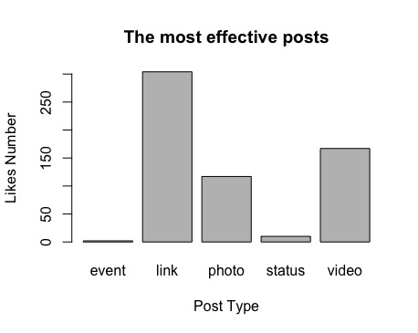
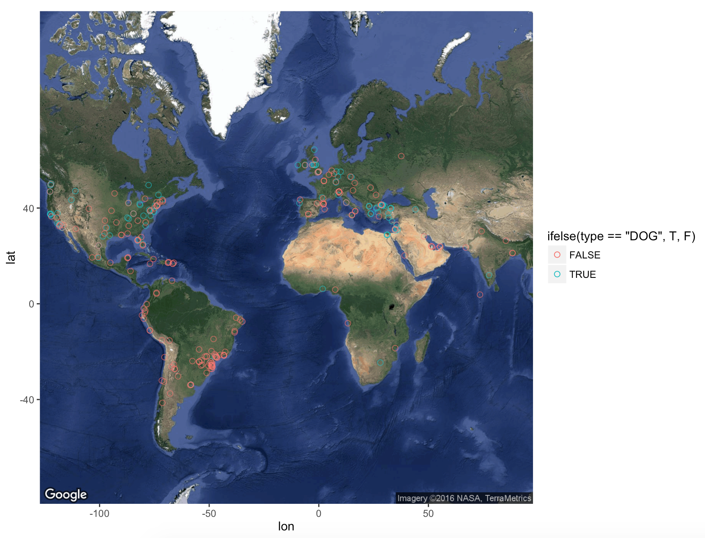

### Reuired Libaries

```{ echo=FALSE}
require(XML)
require(RCurl)
require(devtools)
require("Rfacebook")
```
# The Most Effective Posts
### Data from facebook - Last added Feeds (23/4/2016)
##### Get only the data about post-type and likes amount

```{ echo=FALSE}
feeds <- getNewsfeed(token, n = 600)
posts <- subset(feeds, select = c(type, likes_count))
```

### Display the data on graph
```{echo=FALSE}
data <- table(posts$type)
barplot(data, main="The most effective posts", xlab="Post Type", ylab ="Likes Number")
```

 

##Conclusions
As you can see, we can clearly see the difference between types of posts. 
There is a clear preference for the posts that contain external links (such as news, etc.). 
Second priority is the type of video content.


# Diversity Among Groups

### Reuired Libaries

```{ echo=FALSE}
require(XML)
require(RCurl)
require("Rfacebook")
require(devtools)
require(ggmap)
```
### Data from facebook - Groups
##### Groups containing information on dogs and cats

```{ echo=FALSE}
dogPage <- searchPages(string="Dog", n=1000, token=fb_oauth)
catPage <-  searchPages(string="Cat", n=1000, token=fb_oauth)
```

### Arranging and filtering the data

```{ echo=FALSE}
dogPage <- subset(dogPage,select = c(latitude,longitude))
dogPage <- na.omit(dogPage)
dogPage <- cbind(dogPage, type = "DOG")

catPage <- subset(catPage,select = c(latitude,longitude))
catPage <- na.omit(catPage)
catPage <- cbind(catPage, type = "CAT")
```

### Make one data-table from the information

```{ echo=FALSE}
total <- rbind(dogPage,catPage)
```

### Display the partition on a satellite map

```{ echo=FALSE}
map <- get_map(location = c(lon = mean(total$longitude),lat = mean(total$latitude)),zoom = 2,maptype = "satellite",scale = 2 )

ggmap(map) + geom_point(data = total, aes(x = longitude,y = latitude, colour  = ifelse(type == "DOG",T,F), alpha = 1), size = 2 , shape = 21) + guides( fill = FALSE,alpha = FALSE,size = FALSE)
```
 

##Conclusions
You can see that there is quite equal distribution of preferences, with a little preference for cats.
Also, we see that, for example in the South America have absolute preference for cats compared to North America and Europe were split evenly. We can conclude that - As a more advanced state then has more diversity of opinion on these issues
